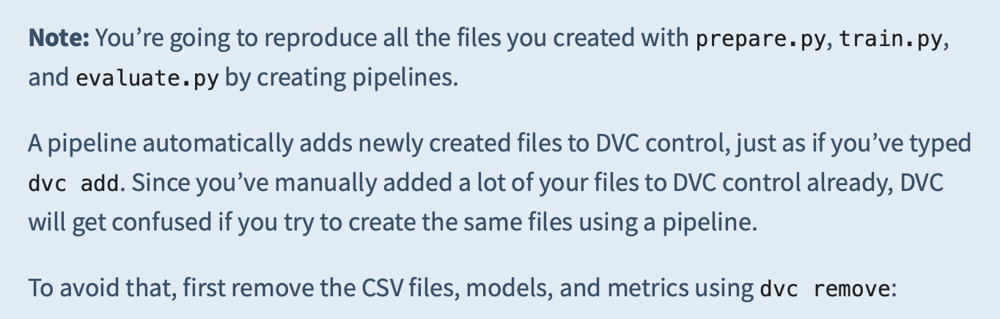

# Data Version Control Tutorial

Example repository for the [Data Version Control With Python and DVC](https://realpython.com/python-data-version-control/) article on [Real Python](https://realpython.com/).

To use this repo as part of the tutorial, you first need to get your own copy. Click the _Fork_ button in the top-right corner of the screen, and select your private account in the window that pops up. GitHub will create a forked copy of the repository under your account.

Clone the forked repository to your computer with the `git clone` command

```console
git clone git@github.com:YourUsername/data-version-control.git
```

Make sure to replace `YourUsername` in the above command with your actual GitHub username.

Happy coding!

```
```

# summary notes on dvc tutorial

### 20240807, thursday 

- https://realpython.com/python-data-version-control/

```
$ conda create --name dvc python=3.12.4 -y
```

- ...

```
$ conda activate dvc
```

- ...

```
$ conda config --add channels conda-forge
```

- ...

```
$ conda install dvc scikit-learn scikit-image pandas numpy -y
```

or 

```
$ conda install -c conda-forge dvc scikit-learn scikit-image pandas numpy -y

```

### ready to use dvc!

- ...

```
$ git clone https://github.com/odsogunro/data-version-control.git
```

- ...

```
$ cd data-version-control
```

- get imagnette data
```
$ curl -o ./data/imagenette2-160.tgz  https://s3.amazonaws.com/fast-ai-imageclas/imagenette2-160.tgz

or

$ curl https://s3.amazonaws.com/fast-ai-imageclas/imagenette2-160.tgz -o ./data/imagenette2-160.tgz

or 
$ wget ./data https://s3.amazonaws.com/fast-ai-imageclas/imagenette2-160.tgz 
```

- unzip and copy to ./data/raw/ directory
```
$ tar -xvzf ./data/imagenette2-160.tgz -C ./data
```
- ... 
```
$ tree -L 1 ./data/imagenette2-160

./data/imagenette2-160
├── noisy_imagenette.csv
├── train
└── val
```

- ...
```
$ mv ./data/imagenette2-160/train ./data/raw/train
$ mv ./data/imagenette2-160/val ./data/raw/val

or 

$ rsync -av --info=progress1 ./data/imagenette2-160/train ./data/raw
$ rsync -av --info=progress1 ./data/imagenette2-160/val ./data/raw

or

$ rsync -av --info=progress2 ./data/imagenette2-160/train ./data/raw
$ rsync -av --info=progress2 ./data/imagenette2-160/val ./data/raw

```

- ...
```
$ tree -L 4 .
.
├── LICENSE
├── README.md
├── data
│   ├── imagenette2-160
│   │   ├── noisy_imagenette.csv
│   │   ├── train
│   │   │   ├── n01440764
│   │   │   ├── n02102040
│   │   │   ├── n02979186
│   │   │   ├── n03000684
│   │   │   ├── n03028079
│   │   │   ├── n03394916
│   │   │   ├── n03417042
│   │   │   ├── n03425413
│   │   │   ├── n03445777
│   │   │   └── n03888257
│   │   └── val
│   │       ├── n01440764
│   │       ├── n02102040
│   │       ├── n02979186
│   │       ├── n03000684
│   │       ├── n03028079
│   │       ├── n03394916
│   │       ├── n03417042
│   │       ├── n03425413
│   │       ├── n03445777
│   │       └── n03888257
│   ├── imagenette2-160.tgz
│   ├── prepared
│   └── raw
│       ├── train
│       │   ├── n01440764
│       │   ├── n02102040
│       │   ├── n02979186
│       │   ├── n03000684
│       │   ├── n03028079
│       │   ├── n03394916
│       │   ├── n03417042
│       │   ├── n03425413
│       │   ├── n03445777
│       │   └── n03888257
│       └── val
│           ├── n01440764
│           ├── n02102040
│           ├── n02979186
│           ├── n03000684
│           ├── n03028079
│           ├── n03394916
│           ├── n03417042
│           ├── n03425413
│           ├── n03445777
│           └── n03888257
├── metrics
├── model
└── src
    ├── evaluate.py
    ├── prepare.py
    └── train.py

52 directories, 7 files
```

- ...
```
$ rm -rf ./data/imagenette2-160
$ rm ./data/imagenette2-160.tgz
```

## Part 01 of 05 - Practice the Basic DVC Workflow - START
- https://realpython.com/python-data-version-control/#build-a-machine-learning-model

### first experiment

- create and checkout branch 
```
$ git checkout -b "first_experiment"
```

### initialize dvc
- https://dvc.org/doc/start
- ...
```
$ dvc init 
---

Initialized DVC repository.

You can now commit the changes to git.

+---------------------------------------------------------------------+
|                                                                     |
|        DVC has enabled anonymous aggregate usage analytics.         |
|     Read the analytics documentation (and how to opt-out) here:     |
|             <https://dvc.org/doc/user-guide/analytics>              |
|                                                                     |
+---------------------------------------------------------------------+

What's next?
------------
- Check out the documentation: <https://dvc.org/doc>
- Get help and share ideas: <https://dvc.org/chat>
- Star us on GitHub: <https://github.com/iterative/dvc>
```

- .dvc/ file structure initialized 
```
tree -L 2 .dvc
.dvc
├── config
└── tmp
    ├── btime
    └── exps
```

- .dvc/config is empty
```
$ cat .dvc/config 
```

### about dvc

```
$ dvc version
DVC version: 3.53.1 (conda)
---------------------------
Platform: Python 3.12.4 on macOS-14.5-x86_64-i386-64bit
Subprojects:
        dvc_data = 3.15.2
        dvc_objects = 5.1.0
        dvc_render = 1.0.2
        dvc_task = 0.4.0
        scmrepo = 3.3.7
Supports:
        http (aiohttp = 3.10.1, aiohttp-retry = 2.8.3),
        https (aiohttp = 3.10.1, aiohttp-retry = 2.8.3)
Config:
        Global: /Users/odsogunro/Library/Application Support/dvc
        System: /Library/Application Support/dvc
Cache types: reflink, hardlink, symlink
Cache directory: apfs on /dev/disk1s4s1
Caches: local
Remotes: local
Workspace directory: apfs on /dev/disk1s4s1
Repo: dvc, git
Repo.site_cache_dir: /Library/Caches/dvc/repo/73eef8caf1abf7cbb1ec83ba02847e56
```

### turn off anonymous analytics tracking
- ...
```
$ dvc config core.analytics false
$ cat .dvc/config                
[core]
    analytics = false
```

### setup local/remote storage and usage
- https://dvc.org/doc/command-reference/remote/add
- https://dvc.org/doc/user-guide/data-management/remote-storage#configuration
- https://anaconda.org/search?q=dvc-
```
$ mkdir ./data/dvc_remote
$ dvc remote add -d remote_storage $HOME/Projects/data-version-control/data/dvc_remote
$ cat .dvc/config        
[core]
    analytics = false
    remote = remote_storage
['remote "remote_storage"']
    url = $HOME/Projects/data-version-control/data/dvc_remote
```

### tracking files

- ...
```
$ dvc add data/raw/train

100% Adding...|████████████████████████████████████████████████████████████████████████████████████████████████████████████████████|1/1 [00:23, 23.96s/file]
                                                                                                                                                
To track the changes with git, run:

        git add data/raw/.gitignore data/raw/train.dvc

To enable auto staging, run:

        dvc config core.autostage true
```

- ...
```
$ dvc add data/raw/val

100% Adding...|████████████████████████████████████████████████████████████████████████████████████████████████████████████████████|1/1 [00:10, 10.24s/file]
                                                                                                                                                
To track the changes with git, run:

        git add data/raw/.gitignore data/raw/val.dvc

To enable auto staging, run:

        dvc config core.autostage true
```

- ...
```
$ git add data/raw/.gitignore data/raw/train.dvc
$ git add data/raw/.gitignore data/raw/val.dvc
$ dvc config core.autostage true 

$ git add --all
On branch first_experiment
Changes to be committed:
  (use "git restore --staged <file>..." to unstage)
        new file:   .dvc/.gitignore
        new file:   .dvc/config
        new file:   .dvcignore
        modified:   .gitignore
        modified:   README.md
        modified:   data/raw/.gitignore
        new file:   data/raw/train.dvc
        new file:   data/raw/val.dvc
```


### uploadling files

- ...
```
$ git commit -m "first commit with setup and dvc files"
[first_experiment 470eda7] first commit with setup and dvc files
 8 files changed, 311 insertions(+)
 create mode 100644 .dvc/.gitignore
 create mode 100644 .dvc/config
 create mode 100644 .dvcignore
 create mode 100644 data/raw/train.dvc
 create mode 100644 data/raw/val.dvc
```

- ...
```
$ dvc push
Collecting                                                                                                                      |13.4k [00:00, 14.9kentry/s]
Pushing
13397 files pushed 
```

- ...
```
$ git push --set-upstream origin first_experiment
```

### downloading files

#### dvc checkout
- delete the data/raw/val to see how the data can be restored from dvc cache of the remote store 
```
$ rm -rf data/raw/val
```

- get the data back from the cache
```
$ dvc checkout data/raw/val.dvc
Building workspace index                                                                                                          |2.00 [00:00,  243entry/s]
Comparing indexes                                                                                                               |3.94k [00:00, 65.4kentry/s]
Applying changes                                                                                                                 |3.92k [00:02, 1.88kfile/s]
A       data/raw/val/
```

#### dvc fetch
- when you clone your GitHub repository on a new machine, the cache will be empty.
- the fetch command gets the contents of the remote storage into the cache.
- ...
```
$ dvc fetch data/raw/val.dvc

$ dvc checkout
```
[or]
#### dvc pull
- ...

```
$ dvc pull
```

### basic day-to-day usage complete.

```
$ conda install -c conda-forge bpython csvkit mamba -y
```

## Part 01 of 05 - Practice the Basic DVC Workflow - END

...

## Part 02 of 05 - Build a Machine Learning Model - START
- https://realpython.com/python-data-version-control/#build-a-machine-learning-model

### building a machine learning model

1. prepare data for training
2. train a machine learning model
3. evaluate the performance of your model

```
tree -L 1 src
src
├── evaluate.py
├── prepare.py
└── train.py

1 directory, 3 files
```

1. run prepare.py
```
$ python src/prepare.py

tree -L 1 data/prepared/ 
data/prepared/
├── test.csv
└── train.csv


$ head -n 5 data/prepared/train.csv | csvlook 
$ tail -n 5 data/prepared/train.csv | csvlook -H


$ csvlook --max-rows 1 data/prepared/train.csv
|     a | filename                                                                                    | label     |
| ----- | ------------------------------------------------------------------------------------------- | --------- |
| False | /Users/odsogunro/Projects/data-version-control/data/raw/train/n03445777/n03445777_5768.JPEG | golf ball |


$ head -n 5 data/prepared/test.csv | csvlook
$ tail -n 5 data/prepared/test.csv | csvlook -H

$ csvlook --max-rows 1 data/prepared/test.csv
|     a | filename                                                                                  | label     |
| ----- | ----------------------------------------------------------------------------------------- | --------- |
| False | /Users/odsogunro/Projects/data-version-control/data/raw/val/n03445777/n03445777_2412.JPEG | golf ball |
```

### training the model

1. read the csv file that tells python where the images are
2. load the training images into memory
3. load the class labels into memory
4. preprocess the images so they can be used for training
5. train a machine learning model to classify the images
6. save the machine learning model to your disk

```
$ python src/train.py

/usr/local/Caskroom/miniconda/base/envs/dvc/lib/python3.12/site-packages/sklearn/linear_model/_stochastic_gradient.py:744: ConvergenceWarning: Maximum number of iteration reached before convergence. Consider increasing max_iter to improve the fit.

$ dvc add model/model.joblib

tree -L 1 model/            
model/
├── model.joblib
└── model.joblib.dvc

1 directory, 2 files

$ git add --all
$ git commit -m "trained an sgd classifier"
```

### evaluating the model

- ...
```
$ python src/evaluate.py

tree -L 1 metrics 
metrics
└── accuracy.json

$ git add --all
$ git commit -m "evaluate the sgd model accuracy"
```

## Part 02 of 05 - Build a Machine Learning Model - END

- ...
```
$ git push
$ dvc push
```

## Part 03 of 05 - Version Datasets and Models - START
- https://realpython.com/python-data-version-control/#version-datasets-and-models

### tagging commits

- ...
```
$ git tag -a sgd-classifier -m "SGDClassifier with accuracy 71.06%"

$ git push origin --tags
Enumerating objects: 1, done.
Counting objects: 100% (1/1), done.
Writing objects: 100% (1/1), 200 bytes | 200.00 KiB/s, done.
Total 1 (delta 0), reused 0 (delta 0), pack-reused 0 (from 0)
To https://github.com/odsogunro/data-version-control.git
 * [new tag]         sgd-classifier -> sgd-classifier

$ git tag
sgd-classifier
```

### creating one git branch per experiment

- ...
```
$ git checkout -b "sgd-100-iterations"
Switched to a new branch 'sgd-100-iterations'

$ python src/train.py
$ python src/evaluate.py

$ dvc commit

$ git add --all
$ git commit -m "change SGD max_iter to 100"
```

- tag the new experiment
```
$ git tag -a sgd-100-iter -m "trained an SGD classifier for 100 iterations"
$ git push origin --tags
```

- ...
```
$ git push --set-upstream origin sgd-100-iterations
$ dvc push
```

### looking inside dvc files

- https://dvc.org/doc/user-guide/project-structure
- ...
```
$ cat model/model.joblib.dvc 
outs:
- md5: fb5d0044da2b85949f1b5d9dd70d3759
  size: 241149
  hash: md5
  path: model.joblib
```

## Part 03 of 05 - Version Datasets and Models - END

...

## Part 04 of 05 - Share a Development Machine - START
- https://realpython.com/python-data-version-control/#share-a-development-machine
- how to configure a shared cache, https://dvc.org/doc/user-guide/how-to/share-a-dvc-cache#configure-the-shared-cache
- how to share a dvc cache, https://dvc.org/doc/user-guide/how-to/share-a-dvc-cache

- changing your cache directory after 'dvc init' to a shared cache on a shared machine
- ...
```
$ dvc cache dir path/to/shared_cache
```
Now every time you run dvc add or dvc commit, the data will be backed up in that folder. When you use dvc fetch to get data from remote storage, it will go to the shared cache, and dvc checkout will bring it to your working repository.

If you’ve been following along and working through the examples in this tutorial, then all your files will be in your repository’s .dvc/cache folder. After executing the above command, move the data from the default cache to the new, shared one:

- ...
```
$ mv .dvc/cache/* path/to/shared_cache
```


Great. Now you have a shared cache that all other users can share for their repositories. If your operating system (OS) doesn’t allow everyone to work with the shared cache, then make sure all the permissions on your system are set correctly. You can find more details on setting up a shared system in the [DVC docs](https://dvc.org/doc/use-cases/fast-data-caching-hub#example-shared-development-server).

If you check your repository’s .dvc/config file, then you’ll see a new section appear:
```
[cache]
    dir = /path/to/shared_cache
```
NOTE: File link types for the DVC cache, https://dvc.org/doc/user-guide/data-management/large-dataset-optimization#file-link-types-for-the-dvc-cache

You can change the default behavior of your cache by changing the cache.type configuration option:
```
$ dvc config cache.type reflink, hardlink, symlink

$ dvc config cache.type reflink
$ dvc config cache.type hardlink
$ dvc config cache.type symlink
```

You can replace symlink with reflink, hardlink, or copies. Research each type of link and choose the most appropriate option for the OS you’re working on. Remember, you can check how your DVC repository is currently configured by reading the .dvc/config file:
```
[cache]
    dir = /path/to/shared_cache
    type = symlink
```

If you make a change to the cache.type, it doesn’t take effect immediately. You need to tell DVC to check out links instead of file copies:

```
$ dvc checkout --relink
```
The --relink switch will tell DVC to check the cache type and relink all the files that are currently tracked by DVC.

If there are models or data files in your repository or cache that aren’t being used, then you can save additional space by cleaning up your repository with dvc gc. **gc** stands for **garbage collection** and will remove any unused files and directories from the cache.


You’re now all set to share a development machine with your team. The next feature to explore is creating pipelines.

## Part 04 of 05 - Share a Development Machine - END

...

## Part 05 of 05 - Create Reproducible Pipelines - START

- defining pipelines, https://dvc.org/doc/user-guide/pipelines/defining-pipelines


recap of the steps you made so far to train your machine learning model:

1. fetching the data
2. reparing the data
3. running training
4. evaluating the training run

- completed in part 01, 02, 03 of 05.
    - fetched data and manually added it to a "remote" storage 
    - can retrieve data with **dvc checkout** and **dvc pull**
    - executed and ran various python files

- can know chain these together into a single execution called a DVC pipeline that requires only one command

```
$ git checkout -b sgd-pipeline
```
use a branch to construct a dvc pipeline, which consists of multiple stages (each stage has three components) and will be executed by the **dvc run** command:

1. inputs &rarr; called  **dependencies** in dvc
2. outputs &rarr; called  **outs** in dvc
3. command


```
$ dvc remove data/prepared/train.csv.dvc \
             data/prepared/test.csv.dvc \
             model/model.joblib.dvc --outs
```


steps in the pipeline are as follows:
1. **dependencies**: prepare.py and the data in data/raw
2. **outs**: train.csv and test.csv
3. **command**: python prepare.py

execute prepare.py as a DVC pipeline stage with the **dvc run** command (**DEPRECATED**):

```
$ dvc run -n prepare \
        -d src/prepare.py -d data/raw \
        -o data/prepared/train.csv -o data/prepared/test.csv \
        python src/prepare.py
```

**UPDATED PIPELINE COMMANDS:** ...
- defining pipelines, https://dvc.org/doc/user-guide/pipelines/defining-pipelines#stages

### stage 01: data preparation

```
$ dvc stage add -n prepare \
              -d src/prepare.py \
              -d data/raw \
              -o data/prepared/train.csv \
              -o data/prepared/test.csv \
              python src/prepare.py

Added stage 'prepare' in 'dvc.yaml'  
```

- ...
```
$ cat dvc.yaml       
stages:
  prepare:
    cmd: python src/prepare.py
    deps:
    - data/raw
    - src/prepare.py
    outs:
    - data/prepared/test.csv
    - data/prepared/train.csv
```

- ...
```
$ dvc repro prepare    
'data/raw/train.dvc' didn't change, skipping                                                                                   
'data/raw/val.dvc' didn't change, skipping                                                                                     
Running stage 'prepare':                                                                                                       
> python src/prepare.py
Generating lock file 'dvc.lock'                                                                                                
Updating lock file 'dvc.lock'
Use `dvc push` to send your updates to remote storage.
```

- ...
```
$ cat dvc.lock 
schema: '2.0'
stages:
  prepare:
    cmd: python src/prepare.py
    deps:
    - path: data/raw
      hash: md5
      md5: dfaf2d4610cc83fdbeb2c8db6b0b3007.dir
      size: 106557388
      nfiles: 13398
    - path: src/prepare.py
      hash: md5
      md5: ef804f358e00edcfe52c865b471f8f55
      size: 1231
    outs:
    - path: data/prepared/test.csv
      hash: md5
      md5: 8f3aeca382c2ff3d98437683c837b56c
      size: 82537
    - path: data/prepared/train.csv
      hash: md5
      md5: 697bc53c7a6b92b1bf4c29526eef763c
      size: 204814
```


### stage 02: model training

- ...
```
$ dvc stage add -n train \
        -d src/train.py \
        -d data/prepared/train.csv \
        -o model/model.joblib \
        python src/train.py

Added stage 'train' in 'dvc.yaml'  
```
- ...
```
$ dvc repro train

'data/raw/train.dvc' didn't change, skipping                                                                                                                          
'data/raw/val.dvc' didn't change, skipping                                                                                                                            
Stage 'prepare' didn't change, skipping                                                                                                                               
Running stage 'train':                                                                                                                                                
> python src/train.py
/usr/local/Caskroom/miniconda/base/envs/dvc/lib/python3.12/site-packages/sklearn/linear_model/_stochastic_gradient.py:744: ConvergenceWarning: Maximum number of iteration reached before convergence. Consider increasing max_iter to improve the fit.
  warnings.warn(
Updating lock file 'dvc.lock'                                                                                                                                         
Use `dvc push` to send your updates to remote storage.
```

- ...
```
$ cat dvc.yaml 
stages:
  prepare:
    cmd: python src/prepare.py
    deps:
    - data/raw
    - src/prepare.py
    outs:
    - data/prepared/test.csv
    - data/prepared/train.csv
  train:
    cmd: python src/train.py
    deps:
    - data/prepared/train.csv
    - src/train.py
    outs:
    - model/model.joblib
```

- ...
```
$ cat dvc.lock 

schema: '2.0'
stages:
  prepare:
    cmd: python src/prepare.py
    deps:
    - path: data/raw
      hash: md5
      md5: dfaf2d4610cc83fdbeb2c8db6b0b3007.dir
      size: 106557388
      nfiles: 13398
    - path: src/prepare.py
      hash: md5
      md5: ef804f358e00edcfe52c865b471f8f55
      size: 1231
    outs:
    - path: data/prepared/test.csv
      hash: md5
      md5: 8f3aeca382c2ff3d98437683c837b56c
      size: 82537
    - path: data/prepared/train.csv
      hash: md5
      md5: 697bc53c7a6b92b1bf4c29526eef763c
      size: 204814
  train:
    cmd: python src/train.py
    deps:
    - path: data/prepared/train.csv
      hash: md5
      md5: 697bc53c7a6b92b1bf4c29526eef763c
      size: 204814
    - path: src/train.py
      hash: md5
      md5: ad34e87f4d781a9d01979df26ca69fca
      size: 1325
    outs:
    - path: model/model.joblib
      hash: md5
      md5: 6a8229f76323709526501c27d122e086
      size: 241149
```


### stage 03: model evaluation

- ...
```
$ dvc stage add -n evaluate \
        -d src/evaluate.py \
        -d model/model.joblib \
        -M metrics/accuracy.json \
        python src/evaluate.py

Added stage 'evaluate' in 'dvc.yaml'  
```

- ...
```
$ cat dvc.yaml

stages:
  prepare:
    cmd: python src/prepare.py
    deps:
    - data/raw
    - src/prepare.py
    outs:
    - data/prepared/test.csv
    - data/prepared/train.csv
  train:
    cmd: python src/train.py
    deps:
    - data/prepared/train.csv
    - src/train.py
    outs:
    - model/model.joblib
  evaluate:
    cmd: python src/evaluate.py
    deps:
    - model/model.joblib
    - src/evaluate.py
    metrics:
    - metrics/accuracy.json:
        cache: false
```

- ...
```
$ dvc repro evaluate  

'data/raw/train.dvc' didn't change, skipping                                                                                                            
'data/raw/val.dvc' didn't change, skipping                                                                                                              
Running stage 'prepare':                                                                                                                                
> python src/prepare.py
/Users/odsogunro/Projects/data-version-control/src/prepare.py
/Users/odsogunro/Projects/data-version-control/src
/Users/odsogunro/Projects/data-version-control
Updating lock file 'dvc.lock'                                                                                                                           

Running stage 'train':                                                                                                                                  
> python src/train.py
/Users/odsogunro/Projects/data-version-control/src/train.py
/Users/odsogunro/Projects/data-version-control/src
/Users/odsogunro/Projects/data-version-control
Updating lock file 'dvc.lock'                                                                                                                           

Running stage 'evaluate':                                                                                                                               
> python src/evaluate.py
/Users/odsogunro/Projects/data-version-control/src/evaluate.py
/Users/odsogunro/Projects/data-version-control/src
/Users/odsogunro/Projects/data-version-control
Updating lock file 'dvc.lock'                                                                                                                           
Use `dvc push` to send your updates to remote storage.
```

- ...
```
$ cat dvc.lock      

schema: '2.0'
stages:
  prepare:
    cmd: python src/prepare.py
    deps:
    - path: data/raw
      hash: md5
      md5: dfaf2d4610cc83fdbeb2c8db6b0b3007.dir
      size: 106557388
      nfiles: 13398
    - path: src/prepare.py
      hash: md5
      md5: 1d829fea70e64ab92c856b917caeb662
      size: 1563
    outs:
    - path: data/prepared/test.csv
      hash: md5
      md5: 8f3aeca382c2ff3d98437683c837b56c
      size: 82537
    - path: data/prepared/train.csv
      hash: md5
      md5: 697bc53c7a6b92b1bf4c29526eef763c
      size: 204814
  train:
    cmd: python src/train.py
    deps:
    - path: data/prepared/train.csv
      hash: md5
      md5: 697bc53c7a6b92b1bf4c29526eef763c
      size: 204814
    - path: src/train.py
      hash: md5
      md5: f59e764783df3aff4d3b79d36a644e4b
      size: 1656
    outs:
    - path: model/model.joblib
      hash: md5
      md5: 6ac129db47fda3f39b6479c94ddda2e1
      size: 241149
  evaluate:
    cmd: python src/evaluate.py
    deps:
    - path: model/model.joblib
      hash: md5
      md5: 6ac129db47fda3f39b6479c94ddda2e1
      size: 241149
    - path: src/evaluate.py
      hash: md5
      md5: 4d23f691d843d7bd621eb7350420f4e5
      size: 976
    outs:
    - path: metrics/accuracy.json
      hash: md5
      md5: b6f63486648b31c9da18a4530cda5d41
      size: 32
```

- ...
```
$  dvc metrics show
Path                   accuracy
metrics/accuracy.json  0.77567
```


## Part 05 of 05 - Create Reproducible Pipelines - END
